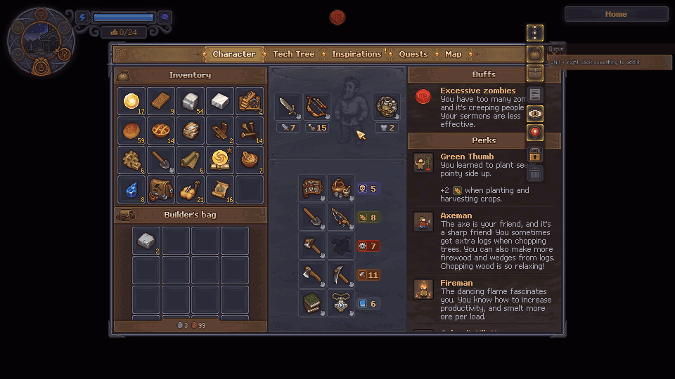
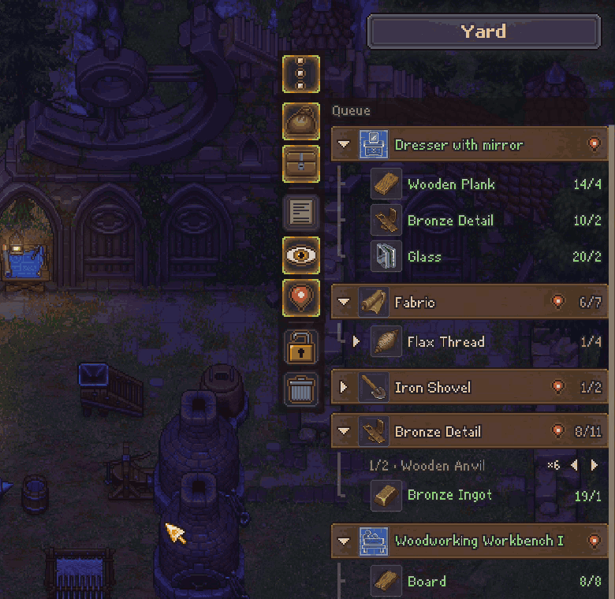
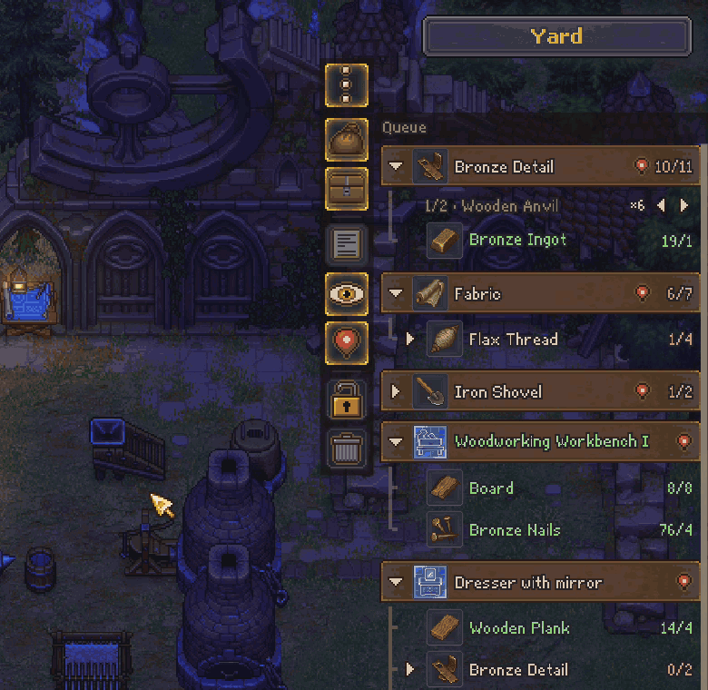
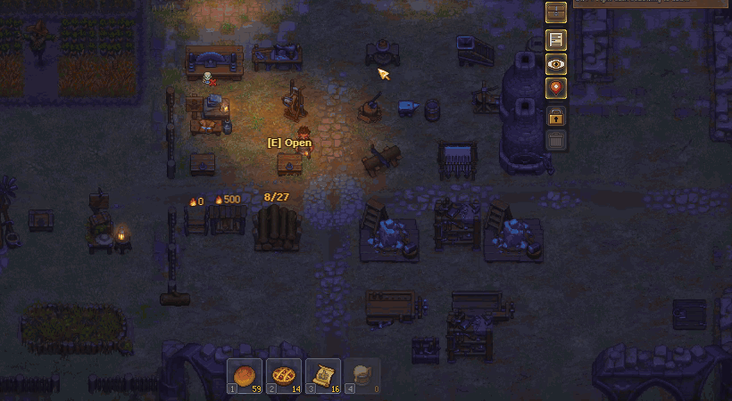
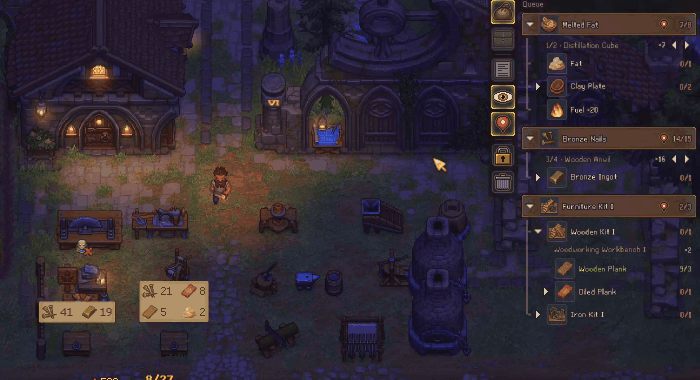
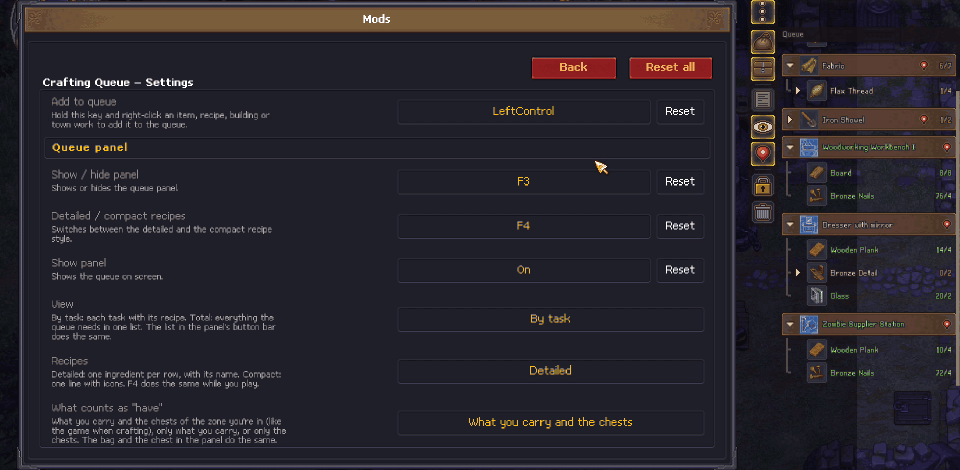

# Crafting Queue para Graveyard Keeper 2

[English](README.md) | **Español** · [Nexus Mods](https://www.nexusmods.com/graveyardkeeper2/mods/177)

¿Alguna vez llegaste a la mesa de trabajo y ya no recordabas qué pedía la receta, o en qué cofre dejaste las tablas? **Crafting Queue** mantiene una pequeña lista de pendientes siempre a la vista: **Ctrl + clic derecho** sobre cualquier cosa para agregarla, y el panel muestra qué quieres hacer, qué necesitas, qué ya tienes y en qué cofre está.

> ⚠️ **Versión de prueba (beta).** Todavía se está probando y puede tener algunos bugs. Por favor [repórtalos](#reportar-bugs); ayuda muchísimo.
> 🎮 **El soporte para control es aún más experimental** y casi no se ha probado.



---

## Instalación (unos 2 minutos, sin experiencia)

Solo se hace una vez. Cierra el juego antes de empezar.

### Paso 1: Descarga dos archivos

1. **BepInEx 5**, el cargador de mods (sáltatelo si ya juegas con otros mods de BepInEx): en su [página oficial](https://github.com/BepInEx/BepInEx/releases/tag/v5.4.23.5), descarga **`BepInEx_win_x64_5.4.23.5.zip`**.
2. **Crafting Queue**: en [Releases](../../releases) o en la [página de Nexus Mods](https://www.nexusmods.com/graveyardkeeper2/mods/177), descarga **`CraftingQueue-x.y.z.zip`**.

*Opcional:* [GK2 Mod Framework](https://www.nexusmods.com/graveyardkeeper2/mods/42) agrega al juego un menú **Mods** con todos los ajustes de este mod. Se instala siguiendo su propia página, cuando quieras.

### Paso 2: Copia la dirección de la carpeta del juego

1. Abre **Steam** y ve a tu **Biblioteca**.
2. Clic derecho en **Graveyard Keeper 2** → **Administrar** → **Ver archivos locales**. Se abre una carpeta: esa es la *carpeta del juego*.
3. Da clic en la **barra de direcciones**, arriba de la carpeta (donde aparece la ruta), y presiona **Ctrl + C** para copiarla.

> 💡 No importa en qué disco o carpeta tengas el juego: Steam siempre abre la correcta.

### Paso 3: Descomprime los dos archivos en esa carpeta

Hazlo primero con BepInEx y luego con Crafting Queue:

1. Busca el archivo que descargaste (normalmente está en **Descargas**).
2. Clic derecho sobre él → **Extraer todo…**
3. Borra la ruta que aparece en el cuadro y presiona **Ctrl + V** para pegar la dirección de la carpeta del juego.
4. Da clic en **Extraer**. Si Windows pregunta por reemplazar archivos, elige **Reemplazar**.

### Paso 4: Revisa que quedó bien

Abre otra vez la carpeta del juego. Ahora debe haber una carpeta **`BepInEx`** junto a `GraveyardKeeper2.exe`:

```
Graveyard Keeper 2
├─ BepInEx               ← nuevo (adentro: plugins\CraftingQueue)
├─ winhttp.dll           ← nuevo
├─ doorstop_config.ini   ← nuevo
└─ GraveyardKeeper2.exe
```

Abre el juego y carga tu partida. Arriba a la derecha aparece el panel **Cola**. 🎉
Para agregar algo, mantén **Ctrl** y da clic derecho sobre cualquier objeto.

<details>
<summary><b>¿Algo salió mal?</b></summary>

| Lo que ves | Qué hacer |
|---|---|
| Dentro de la carpeta del juego quedó una carpeta llamada `CraftingQueue-...` o `BepInEx_win_x64...` con `BepInEx` adentro | Mueve todo lo que está dentro de esa carpeta a la carpeta del juego y borra la carpeta vacía. |
| No hay `winhttp.dll` junto a `GraveyardKeeper2.exe` | BepInEx no está instalado: descomprime `BepInEx_win_x64_5.4.23.5.zip` en la carpeta del juego (Paso 3). |
| El juego abre pero no aparece el panel | Presiona **F3** (puede estar oculto). Si sigue sin aparecer, abre **Solución de problemas** casi al final de esta página. |
| Windows o el antivirus avisan sobre `winhttp.dll` | Ese archivo es parte de BepInEx, el cargador de mods estándar de los juegos de Unity. Es seguro; permítelo. |

</details>

<details>
<summary><b>Actualizar o desinstalar</b></summary>

- **Actualizar:** descarga la versión nueva y descomprímela igual, eligiendo **Reemplazar**. Tu cola se conserva.
- **Desinstalar:** borra la carpeta `BepInEx\plugins\CraftingQueue` dentro de la carpeta del juego. Tus partidas no se tocan.
- Tus colas se guardan fuera de la carpeta del juego, así que se conservan al actualizar o reinstalar. Para borrarlas también, borra `%USERPROFILE%\AppData\LocalLow\Lazy Bear Games\Graveyard Keeper 2\CraftingQueue` (pégalo en la barra de direcciones del Explorador).

</details>

---

## Qué hace

### Panel de la cola siempre a la vista

`tienes/necesitas` de cada material. Despliega cualquier material para ver cómo se hace, una receta a la vez, con la estación donde se hace y cuánto sale (`×N`).


- **Una opción por receta y por estación.** Si un objeto tiene varias recetas, o una receta se hace en varias estaciones, cambias entre ellas con ◂ ▸. Cada opción muestra su estación, su cantidad y lo que pide.
- **Solo lo que puedes usar.** Las recetas que aún no desbloqueas no aparecen, ni las estaciones que todavía no puedes construir. En cuanto las desbloqueas (árbol tecnológico, misiones…), aparecen solas.
- **Cantidades reales.** El `×N` toma en cuenta tus talentos, o los de un zombi si trabaja esa estación. Para una estación que aún no construyes, muestra el edificio base con tus talentos.
- **Una tarea pide *tener* esa cantidad.** Lo que ya tienes cuenta, y la receta de abajo es solo para lo que falta. Ctrl + clic derecho en un objeto o una receta pide uno más de lo que tienes; los pedidos (NPC, misiones, encargos, construcciones) piden su cantidad exacta.
- **Los materiales compartidos se reparten en el orden de la cola.** Si dos tareas usan troncos, la de arriba toma primero lo que tienes y la siguiente lo que sobra. Arrastra una tarea por su título para subirla o bajarla.
- **Las tareas se completan solas** cuando crafteas, recoges o compras lo que faltaba. Las construcciones y obras del pueblo bajan al construirlas.
- **Lo que tienes en otras zonas.** Si aquí no te alcanza pero tienes en otra zona, pasa el mouse por el renglón y te dice dónde: `Yard: 7`.
- **Los objetos llenan su celda,** para reconocerlos de un vistazo.
- **Pasa el mouse sobre una tarea** para ver sus botones − + 🗑 y su pin. Con **Shift**, la cantidad cambia de 10 en 10. Cada botón explica qué hace al pasarle el mouse.
- **Arrastra una tarea para cambiarla de lugar.** Tómala por su título y suéltala donde quieras: una línea dorada marca dónde va a quedar, y la lista se desplaza sola cerca de la orilla de arriba o de abajo. Clic derecho o Esc cancela.
- **Muévelo y cámbiale el tamaño.** Abre el candado de la barra de botones y arrastra el título para moverlo, o el agarre de su esquina de abajo para cambiar su tamaño. Nombres e íconos se reacomodan mientras arrastras, y los íconos se achican solos si el panel es angosto.
- **Tamaño de íconos y letra con la rueda del mouse:** sobre el panel, **Ctrl + rueda** cambia el tamaño de los íconos y **Shift + rueda** el de la letra.





### La barra de botones

Siete botones en las celdas de objeto del propio juego. Salen de la **esquina ⋮**, justo afuera de la esquina de arriba del panel: un clic y la barra baja deslizándose por el costado del panel (o corre por encima del panel, si lo prefieres: *Botones arriba* en el menú Mods, `BotonesArriba` en la configuración); otro clic y se guarda. Con clic derecho en la esquina cambia entre el costado y por encima del panel. El título del panel, «Cola», se queda donde está. Marco dorado = prendido; celda sombreada = apagado.

- **La bolsa y el cofre** eligen qué cuenta como "tienes". Los dos prendidos (de fábrica): lo que llevas encima más los cofres y almacenes de la zona donde estás, como el juego al craftear. Solo la bolsa: solo lo que llevas. Solo el cofre: solo lo guardado en la zona. Uno de los dos siempre queda prendido.
- **La hoja** cambia a la vista **Total**: todo lo que pide la cola en una sola lista, un renglón por material, sumado de todas tus tareas. Es lo que todavía tienes que conseguir, con lo que falta primero.
- **El ojo** deja el panel siempre visible (ojo abierto). Cerrado, el panel se recorre o se pliega con cofres y mesas.
- **El pin** muestra las burbujas de toda la cola en los cofres.
- **El candado** te deja mover el panel (arrastrando el título) y cambiar su tamaño (el agarre de la esquina).
- **El bote** vacía la cola completa. Se pone rojo al pasarle el mouse y, al primer clic, se vuelve una palomita dorada: clic en la palomita para confirmar.

Los botones nunca se estiran ni se encogen con el panel: miden siempre 26 pixeles del juego, igual de nítidos que sus íconos. La esquina ⋮ va del lado del panel que mira al centro de la pantalla, y también sirve para arrastrar el panel. Si el panel está hasta abajo de la pantalla, la barra sube desde la esquina. Por encima del panel, un grupo de botones baja a un segundo renglón si el panel mide menos de 200 de ancho, y el panel baja con él.

### Agrega lo que sea con Ctrl + clic derecho

Funciona en casi todo lo que muestra un objeto o una receta:

| Dónde | Qué se agrega |
|---|---|
| Inventario, cofres, cualquier objeto | El objeto |
| Una receta en una mesa de crafteo | "Hacer esta receta", con sus ingredientes |
| Menú de construir / obras del pueblo | La construcción con sus materiales |
| Requisitos de misión | El objeto, con la cantidad que pide la misión |
| Árbol tecnológico | La receta, objeto o construcción (plano) que desbloquea |
| Conversaciones con NPC (respuestas con "0/1") y ventanas de pedido | El objeto que te piden, con su cantidad |
| Encargos de comerciantes | El objeto del encargo, con lo que todavía le falta (cuenta lo ya entregado y lo que está en las tarimas) |

Si el panel está plegado porque hay una ventana abierta, se despliega un momento para que veas la tarea nueva.




### Burbujas en los cofres: ve dónde está todo

Burbujas sobre los cofres y almacenes de tu zona muestran qué materiales de tu cola tienen y cuántos.



- **Pasa el mouse sobre una tarea o un ingrediente** del panel para ver al momento dónde están sus materiales, aunque no tenga pin.
- El **pin de la barra de botones** (marco dorado cuando está prendido) marca los materiales de toda la cola. El **pin de una tarea** marca solo esa tarea. Las tareas nuevas empiezan con su pin prendido. Los pines se guardan con tu partida.
- Si ya tienes un objeto, se marca solo el objeto, para que sepas dónde recogerlo. Si no, se marcan sus ingredientes.
- Las burbujas usan el pergamino del propio juego, y se vuelven transparentes cuando el mouse está encima o cuando tapan a tu personaje.

### Vista rápida de recetas (Alt)

Mantén **Alt** sobre cualquier objeto, en tu inventario, un cofre o el mismo panel de la cola, para ver su árbol de recetas completo sin agregarlo.


### Y además

- **No estorba:** con un cofre, una mesa o el árbol tecnológico abierto, el panel se recorre de su lado o se pliega en una pestañita "Cola" que se despliega al pasar el mouse. ¿Lo prefieres siempre visible? Abre el **ojo** de la barra de botones.
- **No estorba cuando el juego despeja la pantalla:** el panel se oculta cuando el juego esconde su propia interfaz (escenas de historia, al colocar una construcción, al cargar una partida) y mientras preparas y peleas una batalla.
- **Del tamaño de la interfaz del juego, en cualquier resolución.** El panel usa la misma escala que la interfaz del juego (×2 en 720p, 1080p y 1440p, ×4 en 4K…): su letra es del tamaño de la del juego y todo se ve nítido.
- **Muy ligero.** Las cantidades se actualizan en su lugar en vez de redibujar el panel, cerrar un menú o cambiar de zona no lo rearma, y no corre nada pesado mientras juegas (unos 0.1 ms por cuadro en promedio).
- **Una cola por partida guardada,** en su propio archivo y guardada de forma que un cierre inesperado no la borre. Una partida nueva nunca hereda la cola de una partida borrada (las colas viejas se guardan en la carpeta `anteriores`, por si acaso).
- **Opciones:** ocultar el panel mientras la cola está vacía; los botones por el costado o por encima del panel; tamaño de letra de 8 a 32 (16 es la del juego; 8, 16, 24 y 32 se ven perfectos); opacidad de todo el panel o solo de su fondo.
- **Ajustes dentro del juego (opcional):** con [GK2 Mod Framework](https://www.nexusmods.com/graveyardkeeper2/mods/42) instalado, todos los ajustes están en el menú **Mods** del juego (ESC), junto con un botón para vaciar la cola. Mientras está abierta la página de Crafting Queue, el panel se ve junto al menú, así que cada cambio se ve al momento, y los valores se actualizan solos cuando cambias el tamaño del panel. Los que son elegir entre varias opciones muestran la elegida con palabras («Por el costado», «Solo lo que llevas»…); un clic pasa a la siguiente.


- **16 idiomas.** Todos los idiomas oficiales del juego; sigue el idioma del juego al momento.

### Qué cambia / compatibilidad

- **No cambia la jugabilidad ni el balance, y nunca toca tu partida.** El mod solo lee datos del juego y agrega su panel; tu cola se guarda en su propio archivo por partida.
- **Una sola cosa funciona distinto:** mientras mantienes **Ctrl**, el clic derecho agrega a la cola en vez de hacer su acción normal.
- **Sin acceso a internet, sin recolectar datos, sin archivos ni recursos del juego incluidos.** Código abierto (MIT).
- **Funciona junto con otros mods.** No cambia cómo se juega, así que es difícil que choque con ellos.

### Requisitos

- Graveyard Keeper 2 (probado en la versión 1.006).
- **Obligatorio:** [BepInEx](https://github.com/BepInEx/BepInEx/releases/tag/v5.4.23.5) 5.4.23.x (`BepInEx_win_x64`), que se instala aparte (Paso 1).
- **Opcional:** [GK2 Mod Framework](https://www.nexusmods.com/graveyardkeeper2/mods/42) 0.1.14 o posterior, para el menú de ajustes dentro del juego.

### Limitaciones conocidas

- "Tienes" cuenta lo que llevas encima más los cofres y almacenes de la zona donde estás, igual que el juego al craftear (o solo una de las dos cosas, con la bolsa y el cofre de la barra). Los cofres de otras zonas solo salen como aviso al pasar el mouse por un renglón.
- Las burbujas solo marcan los cofres de la zona donde estás.
- El soporte para control es experimental, y sigue siendo una beta: por favor [reporta los bugs](#reportar-bugs).

## Controles

| Acción | Teclado / mouse | Control *(experimental)* |
|---|---|---|
| Agregar a la cola | `Ctrl` + clic derecho | Tocar **R3** sobre lo seleccionado |
| Ver una receta | Mantener `Alt` sobre un objeto | Mantener **R3** sobre lo seleccionado |
| Mostrar / ocultar el panel | `F3` | – |
| Recetas detalladas / compactas | `F4` | – |
| Ver dónde están los materiales de una tarea | Pasar el mouse sobre la tarea | Seleccionarla en el panel |
| Cambiar el orden (prioridad) | Arrastrar la tarea por su título (clic derecho o `Esc` cancela) | – |
| Cambiar una cantidad | Pasar el mouse sobre la tarea → − + (**Shift**: de 10 en 10) | X / Y en el panel |
| Sacar / guardar los botones | Clic en la esquina ⋮ del panel (clic derecho: por el costado o por encima) | – |
| Qué cuenta como "tienes" | La bolsa y el cofre de la barra de botones | – |
| Vista Total | La hoja de la barra de botones | **View** en el panel |
| Vaciar la cola | El bote de la barra de botones (dos clics) | – |
| Mover / cambiar el tamaño | Abrir el candado → arrastrar el título o la esquina ⋮ / el agarre de la esquina | – |
| Tamaño de íconos / letra | `Ctrl` + rueda / `Shift` + rueda sobre el panel | – |
| Usar el panel | Mouse | **R3** entrar · cruceta ↑↓ moverse · → abrir · ← cerrar · LB/RB cambiar receta · X/Y −/+ · A pin · View total · B salir |

## Reportar bugs

Abre un [issue](../../issues/new/choose) con:

1. Qué hiciste y qué pasó (una captura ayuda mucho).
2. Tu versión del mod y tu resolución.
3. El archivo `BepInEx\LogOutput.log` de la carpeta del juego (arrástralo al issue).

---

<details>
<summary><b>Configuración</b></summary>

Los ajustes están en `BepInEx\config\verto13.gk2.craftingqueue.cfg` (ábrelo con el Bloc de notas con el juego cerrado). El archivo se crea la primera vez que juegas y cada ajuste viene explicado adentro, en inglés y en español: lado del panel, ancho, alto, tamaño de íconos, opacidad, estilo de receta…

Con [GK2 Mod Framework](https://www.nexusmods.com/graveyardkeeper2/mods/42) instalado, los mismos ajustes están dentro del juego: **ESC → Mods → Crafting Queue**. Los cambios se aplican al momento.

Tus colas se guardan en `%USERPROFILE%\AppData\LocalLow\Lazy Bear Games\Graveyard Keeper 2\CraftingQueue\`.

**Traducciones:** para corregir una traducción o agregar un idioma, copia `BepInEx\plugins\CraftingQueue\lang\_plantilla_en.txt` como `lang\<código de idioma>.txt` y traduce el lado derecho.

**Diagnóstico:** el ajuste `[Diagnóstico] MedirRendimiento` (apagado de fábrica) escribe tiempos en `BepInEx\LogOutput.log` y una lista de las recetas cuya cantidad depende de talentos en la carpeta de las colas. Solo sirve para buscar problemas y no cambia el juego.

</details>

<details>
<summary><b>Solución de problemas</b></summary>

- **No aparece el panel:**
  1. Revisa que exista `BepInEx\LogOutput.log` en la carpeta del juego. Si no existe, BepInEx no quedó instalado (ve el Paso 1).
  2. Si el log existe, busca `Crafting Queue` adentro.
- **El panel está oculto:** presiona `F3`. También se oculta a propósito cuando el juego esconde su propia interfaz (escenas de historia, al colocar una construcción), mientras preparas y peleas una batalla, y con la cola vacía si prendiste esa opción.
- **No salen burbujas en los cofres:** prende el pin de la barra de botones (o el de una tarea), o pasa el mouse sobre una tarea del panel. Las burbujas solo muestran los cofres de la zona donde estás.
- **Una receta no dice cómo se hace:** seguramente aún no la desbloqueas. Aparece sola en cuanto lo hagas.

</details>

<details>
<summary><b>Compilar desde el código</b></summary>

```bash
dotnet build -c Release -p:GameDir="C:\Program Files (x86)\Steam\steamapps\common\Graveyard Keeper 2"
```

`GameDir` debe apuntar a una instalación del juego con BepInEx 5. Los ensamblados del juego solo se referencian para compilar; nunca se copian a la salida ni a este repositorio.

</details>

## Notas

- Mod no oficial, sin relación con Lazy Bear Games.
- Hecho con apoyo de inteligencia artificial ([Claude](https://claude.com), de Anthropic): el código se escribió junto con Claude y cada función se probó en el juego antes de publicarla.
- No incluye código ni recursos del juego y no envía datos a ningún lado.

## Licencia

[MIT](LICENSE)
