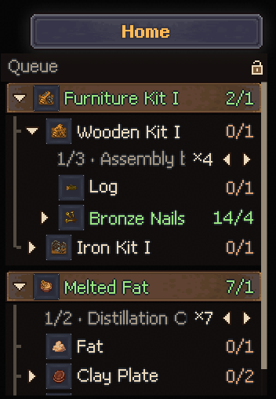

# Crafting Queue for Graveyard Keeper 2

A mod that keeps a **crafting queue always on screen**. It shows what you want to make, what it takes, what you already have, and which chest it's in.

> ⚠️ **Beta.** The mod is still being tested, so expect some bugs. Please [report them](#reporting-bugs). It really helps.
> 🎮 **Gamepad support is even more experimental.** It has barely been tested yet.

> 🇪🇸 **¿Español?** → [Leer en español](#español)


---

## Installation (2 minutes)

### 1. Find your game folder

In Steam, right-click **Graveyard Keeper 2** → **Manage** → **Browse local files**. The folder that opens is your *game folder*. It contains `GraveyardKeeper2.exe`.

### 2. Download the right file from [Releases](../../releases/latest)

| If… | Download |
|---|---|
| You have **never installed mods** in Graveyard Keeper 2 | **`CraftingQueue-x.y.z-with-BepInEx.zip`** (includes the mod loader) |
| You already use **BepInEx 5** mods | **`CraftingQueue-x.y.z.zip`** (just the mod) |

### 3. Extract it into the game folder

Open the zip, select everything inside, and drag it into the game folder. If Windows asks, choose **Replace**.

When you're done, the game folder should look like this:

```
Graveyard Keeper 2\
├─ BepInEx\
│  ├─ core\ ...
│  └─ plugins\
│     └─ CraftingQueue\
│        └─ CraftingQueue.dll
├─ winhttp.dll
├─ doorstop_config.ini
└─ GraveyardKeeper2.exe
```

### 4. Play

Start the game and load your save. The **Queue** panel appears at the top right. Hold **Ctrl** and right-click any item to add it.

**Nothing shows up?** See [Troubleshooting](#troubleshooting).

**Uninstall:** delete `BepInEx\plugins\CraftingQueue`. Your save files are never touched.

---

## Features

### Queue panel, always visible

`have/need` for every material. Expand any material to see how it's made, one recipe at a time. When there are several recipes, switch with ◂ ▸; each one shows the station it uses and how many it makes.



- **Add with Ctrl + right-click:** items, recipes in a crafting station, buildings in the build menu, and town works (repair/upgrade).
- **Real yields:** the `×N` takes your perks and station upgrades into account, not just the base recipe.
- **Automatic progress:** tasks go down on their own when you craft, build, or finish a town work.
- **Hover a task** to show its − + 🗑 buttons. Drag the title to move the panel; the lock pins it in place.

### Chest bubbles: see where everything is

Bubbles over the chests and storages in your current zone show which queued materials they hold, and how many.


- The **pin next to the lock** marks materials for the whole queue. A **task's pin** marks only that task.
- If you already have an item, only the item itself is marked, so you know where to pick it up. If you don't, its ingredients are marked instead.
- Bubbles turn transparent when your mouse is over them or when they cover your character.

### And also

- **Quick recipe view:** hold **Alt** over any item to see its recipe tree without adding it.
- **Stays out of the way:** with a chest or station open, the panel moves beside the window. At small resolutions it folds into a small "Queue" tab that expands when you hover it.
- **Pixel-crisp** at 720p, 1080p, 1440p and 4K.
- **One queue per save slot.** It's saved in its own file and never touches your save.
- **16 languages.** All of the game's official languages; it follows the game's language live.

## Controls

| Action | Keyboard / mouse | Gamepad *(experimental)* |
|---|---|---|
| Add to queue | `Ctrl` + right-click | Tap **R3** on the selected slot |
| Show a recipe | Hold `Alt` over an item | Hold **R3** on the selected slot |
| Show / hide panel | `F3` | – |
| Detailed / compact recipes | `F4` | – |
| Use the panel | Mouse | **R3** to enter · D-pad ↑↓ move · → open · ← close · LB/RB switch recipe · X/Y −/+ · A pin · B exit |

## Configuration

Settings live in `BepInEx\config\verto13.gk2.craftingqueue.cfg`. The file is created the first time you play, and every setting is documented inside it: keys, panel side, width, height, icon size, opacity, recipe style…

Your queues are saved in `%USERPROFILE%\AppData\LocalLow\Lazy Bear Games\Graveyard Keeper 2\CraftingQueue\`.

**Translations:** to fix a translation or add a language, copy `BepInEx\plugins\CraftingQueue\lang\_plantilla_en.txt` to `lang\<language code>.txt` and translate the right-hand side.

## Troubleshooting

- **The panel doesn't appear:**
  1. Check that `BepInEx\LogOutput.log` exists in the game folder. If it doesn't, BepInEx isn't installed; use the *with-BepInEx* zip.
  2. If the log exists, look inside it for `Crafting Queue`.
- **The panel is hidden:** press `F3`.
- **No chest bubbles:** turn on the pin next to the lock (or a task's pin). Bubbles only show chests in the zone you're in.

## Reporting bugs

Open an [issue](../../issues/new/choose) and include:

1. What you did and what happened (a screenshot helps a lot).
2. Your mod version and game resolution.
3. The file `BepInEx\LogOutput.log` from your game folder (drag it into the issue).

## Building from source

```bash
dotnet build -c Release -p:GameDir="C:\Program Files (x86)\Steam\steamapps\common\Graveyard Keeper 2"
```

`GameDir` must point to a game install with BepInEx 5. The game's assemblies are only referenced to compile; they are never copied into the output or this repository.

## Notes

- Unofficial mod, not affiliated with Lazy Bear Games.
- Contains no game code or assets, and sends no data anywhere.
- Inspired by the idea behind **"No More Running Back"** by Amosa Yang (Steam Workshop). This is an independent implementation that shares no code with it. If you use both, you'll see two queue panels.
- The *with-BepInEx* package includes [BepInEx](https://github.com/BepInEx/BepInEx) 5.4.23.5, unmodified (LGPL-2.1).

## License

[MIT](LICENSE)

---

## Español

Un mod que mantiene una **cola de crafteo siempre a la vista**. Muestra qué quieres hacer, qué necesitas, qué ya tienes y en qué cofre está.

> ⚠️ **Versión de prueba (beta).** Todavía se está probando y puede tener algunos bugs. Por favor [repórtalos](#reportar-bugs); ayuda muchísimo.
> 🎮 **El soporte para control es aún más experimental** y casi no se ha probado.

### Instalación (2 minutos)

1. **Encuentra la carpeta del juego:** en Steam, clic derecho en **Graveyard Keeper 2** → **Administrar** → **Ver archivos locales**. Es la carpeta donde está `GraveyardKeeper2.exe`.
2. **Descarga el archivo correcto** desde [Releases](../../releases/latest):
   - **Nunca has instalado mods** en este juego → **`CraftingQueue-x.y.z-with-BepInEx.zip`** (incluye el cargador de mods).
   - **Ya usas mods de BepInEx 5** → **`CraftingQueue-x.y.z.zip`** (solo el mod).
3. **Descomprímelo dentro de la carpeta del juego:** abre el zip, selecciona todo y arrástralo a la carpeta. Si Windows pregunta, elige **Reemplazar**.
4. **Juega:** carga tu partida y verás el panel **Cola** arriba a la derecha. Mantén **Ctrl** y da clic derecho sobre cualquier objeto para agregarlo.

**Desinstalar:** borra la carpeta `BepInEx\plugins\CraftingQueue`. Tus partidas no se tocan.

### Qué hace

- **Panel de la cola siempre a la vista**, con `tienes/necesitas` de cada material, árbol de recetas y recetas alternativas con ◂ ▸ (mesa y cantidad de cada una).
- **Agregar con Ctrl + clic derecho:** objetos, recetas de mesa, construcciones y obras del pueblo.
- **Cantidades reales**, con tus talentos y mejoras de estación.
- **Descuento automático** al craftear, construir o terminar obras del pueblo.
- **Burbujas sobre los cofres** de tu zona, con los materiales de tu cola que tiene cada uno. El pin junto al candado marca toda la cola; el pin de una tarea, solo esa tarea.
- **Vista rápida:** mantén **Alt** sobre un objeto para ver su receta.
- **No estorba:** con un cofre o mesa abierta se mueve a un lado, o se pliega en resoluciones chicas.
- **Nítido en cualquier resolución.** Una cola por partida guardada. **16 idiomas.**

### Controles

| Acción | Teclado / mouse | Control *(experimental)* |
|---|---|---|
| Agregar a la cola | `Ctrl` + clic derecho | Tocar **R3** sobre lo seleccionado |
| Ver una receta | Mantener `Alt` sobre un objeto | Mantener **R3** sobre lo seleccionado |
| Mostrar / ocultar el panel | `F3` | – |
| Recetas detalladas / compactas | `F4` | – |
| Usar el panel | Mouse | **R3** entrar · cruceta ↑↓ moverse · → abrir · ← cerrar · LB/RB cambiar receta · X/Y −/+ · A pin · B salir |

### Reportar bugs

Abre un [issue](../../issues/new/choose) con:

1. Qué hiciste y qué pasó (una captura ayuda mucho).
2. Tu versión del mod y tu resolución.
3. El archivo `BepInEx\LogOutput.log` de la carpeta del juego (arrástralo al issue).

### Notas

- Mod no oficial, sin relación con Lazy Bear Games.
- No incluye código ni recursos del juego y no envía datos a ningún lado.
- Inspirado en la idea de **"No More Running Back"** de Amosa Yang (Steam Workshop). Es una implementación independiente que no comparte código con ese mod.
