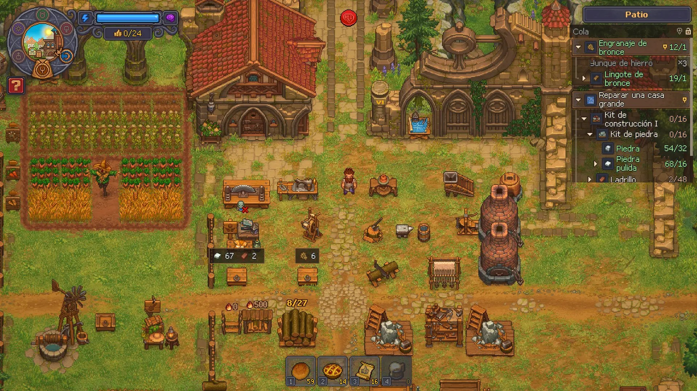
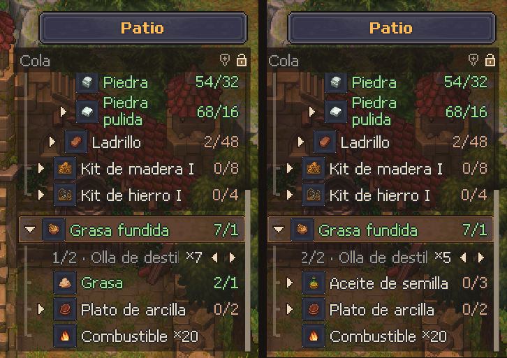
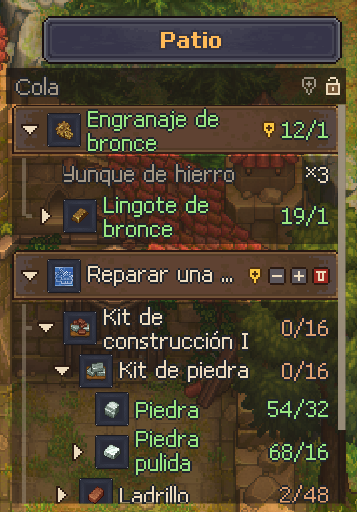
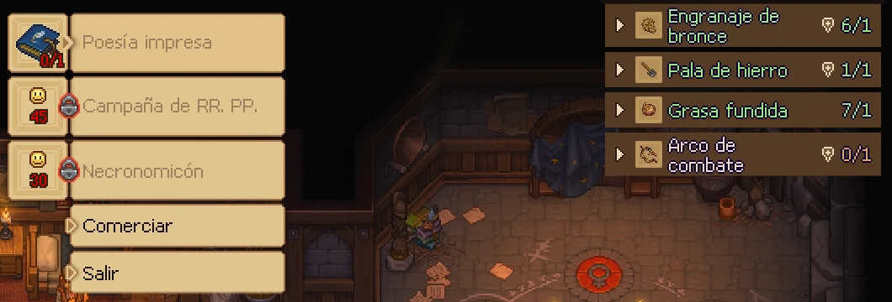
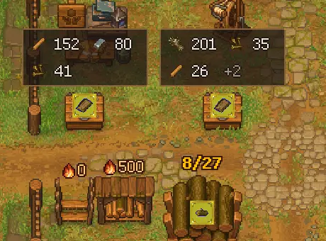
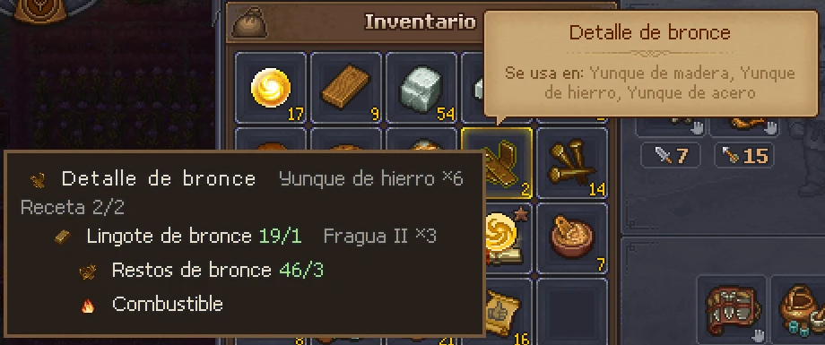
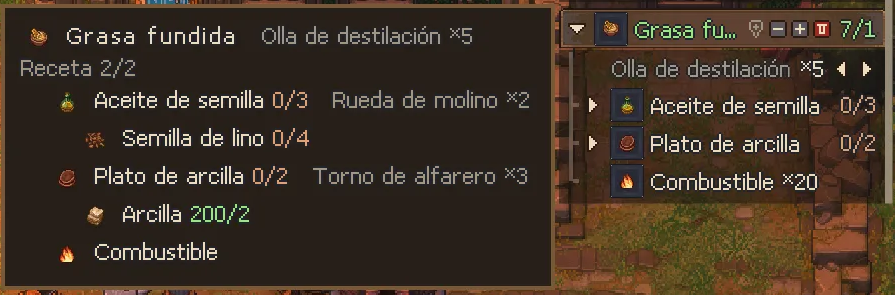

# Crafting Queue for Graveyard Keeper 2

A mod that keeps a **crafting queue always on screen**. It shows what you want to make, what it takes, what you already have, and which chest it's in.

> ⚠️ **Beta.** The mod is still being tested, so expect some bugs. Please [report them](#reporting-bugs). It really helps.
> 🎮 **Gamepad support is even more experimental.** It has barely been tested yet.

> 🇪🇸 **¿Español?** → [Leer en español](#español)



---

## Installation (about 2 minutes, no experience needed)

You only do this once. Close the game before you start.

### Step 1: Download the mod

Go to [Releases](../../releases) and download **one** of these files:

- **`CraftingQueue-x.y.z-with-BepInEx.zip`**: get this one if you're not sure. It has everything you need.
- `CraftingQueue-x.y.z.zip`: only the mod. Use it if you already play with other BepInEx mods.

### Step 2: Copy the address of your game folder

1. Open **Steam** and go to your **Library**.
2. Right-click **Graveyard Keeper 2** → **Manage** → **Browse local files**. A folder opens; this is your *game folder*.
3. Click the **address bar** at the top of that folder (where the path is shown), then press **Ctrl + C** to copy it.

> 💡 It doesn't matter which drive or folder your game is on. Steam always opens the right one.

### Step 3: Extract the mod into that folder

1. Find the file you downloaded (it's usually in **Downloads**).
2. Right-click it → **Extract All…**
3. Delete the path that appears in the box, then press **Ctrl + V** to paste your game folder's address.
4. Click **Extract**. If Windows asks about replacing files, choose **Replace**.

### Step 4: Check that it worked

Open the game folder again. You should now see a **`BepInEx`** folder next to `GraveyardKeeper2.exe`:

```
Graveyard Keeper 2
├─ BepInEx               ← new
├─ winhttp.dll           ← new
├─ doorstop_config.ini   ← new
└─ GraveyardKeeper2.exe
```

Start the game and load your save. A **Queue** panel appears at the top right. 🎉
To add something, hold **Ctrl** and right-click any item.

### Something went wrong?

| What you see | What to do |
|---|---|
| There's a folder called `CraftingQueue-...` inside the game folder, and the `BepInEx` folder is inside it | Move everything from inside that folder into the game folder, then delete the empty folder. |
| The game opens but there's no panel | Press **F3** (it may be hidden). If it's still missing, see [Troubleshooting](#troubleshooting). |
| Windows or your antivirus warns about `winhttp.dll` | That file is part of BepInEx, the standard mod loader for Unity games. It's safe; allow it. |

### Uninstall

Delete the folder `BepInEx\plugins\CraftingQueue` inside your game folder. Your saves are never touched.

---

## Features

### Queue panel, always visible

`have/need` for every material. Expand any material to see how it's made, one recipe at a time, with the station it's made in and how many it makes (`×N`).



- **One option per recipe and per station.** If an item has several recipes, or one recipe can be made in several stations, switch between them with ◂ ▸. Each option shows its own station, yield and ingredients.
- **Only what you can actually use.** Recipes you haven't unlocked stay hidden, and so do stations you can't build yet. As soon as you unlock them (tech tree, quests…), they show up on their own.
- **Real yields.** The `×N` includes your perks and talents, including a zombie's if one works that station. For a station you haven't built yet, it shows the base building plus your perks.
- **Automatic progress.** Tasks go down on their own when you craft, build, or finish a town work.
- **Hover a task** to show its − + 🗑 buttons and its pin. Drag the title to move the panel; the lock pins it in place.



### Add anything with Ctrl + right-click

Works on almost everything that shows an item or a recipe:

| Where | What gets added |
|---|---|
| Inventory, chests, any item | The item |
| A recipe in a crafting station | "Make this recipe" with its ingredients |
| Build menu / town works | The building with its materials |
| Quest requirements | The item, with the amount the quest asks for |
| Tech tree | The recipe, item or building (blueprint) that a tech unlocks |
| NPC conversations ("0/1" answers) and request pop-ups | The item they ask for, with the amount |
| Vendor orders | The ordered item, with the order's amount |

If the panel is folded because a window is open, it unfolds for a moment so you can see the new task.



### Chest bubbles: see where everything is

Bubbles over the chests and storages in your current zone show which queued materials they hold, and how many.



- **Hover a task or an ingredient** in the panel to see where its materials are right away, even without a pin.
- The **pin next to the lock** (gold when on) marks materials for the whole queue. A **task's pin** marks only that task. Pins are saved with your save slot.
- If you already have an item, only the item itself is marked, so you know where to pick it up. If you don't, its ingredients are marked instead.
- Bubbles turn transparent when your mouse is over them or when they cover your character.

### Quick recipe view (Alt)

Hold **Alt** over any item, in your inventory, a chest, or the queue panel itself, to see its full recipe tree without adding it.





### And also

- **Stays out of the way:** with a chest or station open, the panel moves beside the window. At small resolutions it folds into a small "Queue" tab that expands when you hover it.
- **Pixel-crisp** at 720p, 1080p, 1440p and 4K.
- **Light on performance.** Amounts update in place instead of redrawing the panel, and nothing heavy runs while you play (about 0.1 ms per frame on average).
- **One queue per save slot.** It's saved in its own file and never touches your save.
- **16 languages.** All of the game's official languages; it follows the game's language live.

## Controls

| Action | Keyboard / mouse | Gamepad *(experimental)* |
|---|---|---|
| Add to queue | `Ctrl` + right-click | Tap **R3** on the selected slot |
| Show a recipe | Hold `Alt` over an item | Hold **R3** on the selected slot |
| Show / hide panel | `F3` | – |
| Detailed / compact recipes | `F4` | – |
| See where a task's materials are | Hover the task in the panel | Select it in the panel |
| Use the panel | Mouse | **R3** to enter · D-pad ↑↓ move · → open · ← close · LB/RB switch recipe · X/Y −/+ · A pin · B exit |

## Configuration

Settings live in `BepInEx\config\verto13.gk2.craftingqueue.cfg`. The file is created the first time you play, and every setting is documented inside it: keys, panel side, width, height, icon size, opacity, recipe style…

Your queues are saved in `%USERPROFILE%\AppData\LocalLow\Lazy Bear Games\Graveyard Keeper 2\CraftingQueue\`.

**Translations:** to fix a translation or add a language, copy `BepInEx\plugins\CraftingQueue\lang\_plantilla_en.txt` to `lang\<language code>.txt` and translate the right-hand side.

**Diagnostics:** the `[Diagnóstico] MedirRendimiento` setting (off by default) writes timings to `BepInEx\LogOutput.log` and a list of recipes whose yield depends on perks to the queue folder. It's only for tracking down problems and doesn't change the game.

## Troubleshooting

- **The panel doesn't appear:**
  1. Check that `BepInEx\LogOutput.log` exists in the game folder. If it doesn't, BepInEx isn't installed; use the *with-BepInEx* zip.
  2. If the log exists, look inside it for `Crafting Queue`.
- **The panel is hidden:** press `F3`.
- **No chest bubbles:** turn on the pin next to the lock (or a task's pin), or hover a task in the panel. Bubbles only show chests in the zone you're in.
- **A recipe doesn't show how to make it:** you probably haven't unlocked it yet. It appears on its own as soon as you do.

## Reporting bugs

Open an [issue](../../issues/new/choose) and include:

1. What you did and what happened (a screenshot helps a lot).
2. Your mod version and game resolution.
3. The file `BepInEx\LogOutput.log` from your game folder (drag it into the issue).

## Building from source

```bash
dotnet build -c Release -p:GameDir="C:\Program Files (x86)\Steam\steamapps\common\Graveyard Keeper 2"
```

`GameDir` must point to a game install with BepInEx 5. The game's assemblies are only referenced to compile; they are never copied into the output or this repository.

## Notes

- Unofficial mod, not affiliated with Lazy Bear Games.
- Contains no game code or assets, and sends no data anywhere.
- The *with-BepInEx* package includes [BepInEx](https://github.com/BepInEx/BepInEx) 5.4.23.5, unmodified (LGPL-2.1).

## License

[MIT](LICENSE)

---

## Español

Un mod que mantiene una **cola de crafteo siempre a la vista**. Muestra qué quieres hacer, qué necesitas, qué ya tienes y en qué cofre está.

> ⚠️ **Versión de prueba (beta).** Todavía se está probando y puede tener algunos bugs. Por favor [repórtalos](#reportar-bugs); ayuda muchísimo.
> 🎮 **El soporte para control es aún más experimental** y casi no se ha probado.

### Instalación (unos 2 minutos, sin experiencia)

Solo se hace una vez. Cierra el juego antes de empezar.

**Paso 1: Descarga el mod**

Entra a [Releases](../../releases) y descarga **uno** de estos archivos:

- **`CraftingQueue-x.y.z-with-BepInEx.zip`**: elige este si no estás seguro. Trae todo lo necesario.
- `CraftingQueue-x.y.z.zip`: solo el mod, para quien ya juega con otros mods de BepInEx.

**Paso 2: Copia la dirección de la carpeta del juego**

1. Abre **Steam** y ve a tu **Biblioteca**.
2. Clic derecho en **Graveyard Keeper 2** → **Administrar** → **Ver archivos locales**. Se abre una carpeta: esa es la *carpeta del juego*.
3. Da clic en la **barra de direcciones**, arriba de la carpeta (donde aparece la ruta), y presiona **Ctrl + C** para copiarla.

> 💡 No importa en qué disco o carpeta tengas el juego: Steam siempre abre la correcta.

**Paso 3: Descomprime el mod en esa carpeta**

1. Busca el archivo que descargaste (normalmente está en **Descargas**).
2. Clic derecho sobre él → **Extraer todo…**
3. Borra la ruta que aparece en el cuadro y presiona **Ctrl + V** para pegar la dirección de la carpeta del juego.
4. Da clic en **Extraer**. Si Windows pregunta por reemplazar archivos, elige **Reemplazar**.

**Paso 4: Revisa que quedó bien**

Abre otra vez la carpeta del juego. Ahora debe haber una carpeta **`BepInEx`** junto a `GraveyardKeeper2.exe`:

```
Graveyard Keeper 2
├─ BepInEx               ← nuevo
├─ winhttp.dll           ← nuevo
├─ doorstop_config.ini   ← nuevo
└─ GraveyardKeeper2.exe
```

Abre el juego y carga tu partida. Arriba a la derecha aparece el panel **Cola**. 🎉
Para agregar algo, mantén **Ctrl** y da clic derecho sobre cualquier objeto.

**¿Algo salió mal?**

| Lo que ves | Qué hacer |
|---|---|
| Dentro de la carpeta del juego quedó una carpeta llamada `CraftingQueue-...` con `BepInEx` adentro | Mueve todo lo que está dentro de esa carpeta a la carpeta del juego y borra la carpeta vacía. |
| El juego abre pero no aparece el panel | Presiona **F3** (puede estar oculto). Si sigue sin aparecer, revisa que exista `BepInEx\LogOutput.log` en la carpeta del juego; si no existe, BepInEx no quedó instalado. |
| Windows o el antivirus avisan sobre `winhttp.dll` | Ese archivo es parte de BepInEx, el cargador de mods estándar de los juegos de Unity. Es seguro; permítelo. |

**Desinstalar:** borra la carpeta `BepInEx\plugins\CraftingQueue` dentro de la carpeta del juego. Tus partidas no se tocan.

### Qué hace

**Panel de la cola siempre a la vista**
- `tienes/necesitas` de cada material, con el árbol de recetas: cómo se hace, en qué mesa y cuánto sale (`×N`).
- **Una opción por receta y por estación:** si un objeto tiene varias recetas, o una receta se hace en varias estaciones, cambias con ◂ ▸. Cada opción muestra su estación, su cantidad y lo que pide.
- **Solo lo que puedes usar:** las recetas y estaciones que aún no desbloqueas no aparecen. En cuanto las desbloqueas (árbol tecnológico, misiones…), aparecen solas.
- **Cantidades reales:** el `×N` toma en cuenta tus talentos, o los de un zombi si trabaja esa estación. Para una estación que aún no construyes, muestra el edificio base con tus talentos.
- **Descuento automático** al craftear, construir o terminar obras del pueblo.

**Agregar con Ctrl + clic derecho** sobre casi todo lo que muestra un objeto o una receta:

| Dónde | Qué se agrega |
|---|---|
| Inventario, cofres, cualquier objeto | El objeto |
| Una receta en una mesa de crafteo | "Hacer esta receta", con sus ingredientes |
| Menú de construir / obras del pueblo | La construcción con sus materiales |
| Requisitos de misión | El objeto, con la cantidad que pide la misión |
| Árbol tecnológico | La receta, objeto o construcción (plano) que desbloquea |
| Conversaciones con NPC (respuestas con "0/1") y ventanas de pedido | El objeto que te piden, con su cantidad |
| Encargos de comerciantes | El objeto del encargo, con su cantidad |

**Burbujas sobre los cofres** de tu zona, con los materiales de tu cola que tiene cada uno:
- **Pasa el mouse sobre una tarea o un ingrediente** del panel para ver al momento dónde están sus materiales, aunque no tenga pin.
- El pin junto al candado (dorado cuando está prendido) marca toda la cola; el pin de una tarea, solo esa tarea. Los pines se guardan con tu partida.

**Y además:** vista rápida con **Alt** sobre un objeto; el panel se acomoda junto a cofres y mesas (o se pliega en resoluciones chicas); nítido en cualquier resolución; muy ligero (unos 0.1 ms por cuadro); una cola por partida guardada; **16 idiomas**.

### Controles

| Acción | Teclado / mouse | Control *(experimental)* |
|---|---|---|
| Agregar a la cola | `Ctrl` + clic derecho | Tocar **R3** sobre lo seleccionado |
| Ver una receta | Mantener `Alt` sobre un objeto | Mantener **R3** sobre lo seleccionado |
| Mostrar / ocultar el panel | `F3` | – |
| Recetas detalladas / compactas | `F4` | – |
| Ver dónde están los materiales de una tarea | Pasar el mouse sobre la tarea | Seleccionarla en el panel |
| Usar el panel | Mouse | **R3** entrar · cruceta ↑↓ moverse · → abrir · ← cerrar · LB/RB cambiar receta · X/Y −/+ · A pin · B salir |

### Reportar bugs

Abre un [issue](../../issues/new/choose) con:

1. Qué hiciste y qué pasó (una captura ayuda mucho).
2. Tu versión del mod y tu resolución.
3. El archivo `BepInEx\LogOutput.log` de la carpeta del juego (arrástralo al issue).

### Notas

- Mod no oficial, sin relación con Lazy Bear Games.
- No incluye código ni recursos del juego y no envía datos a ningún lado.
