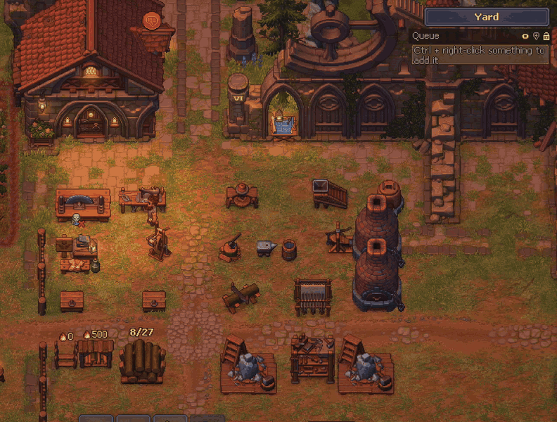
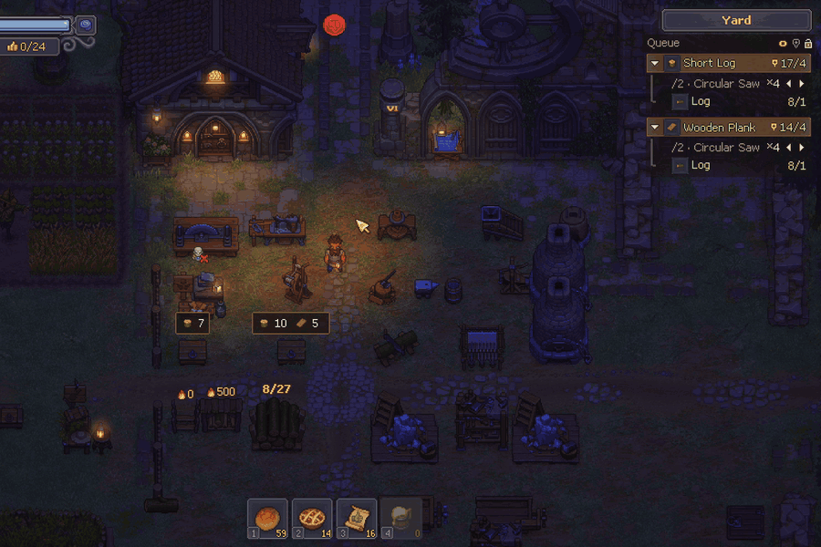
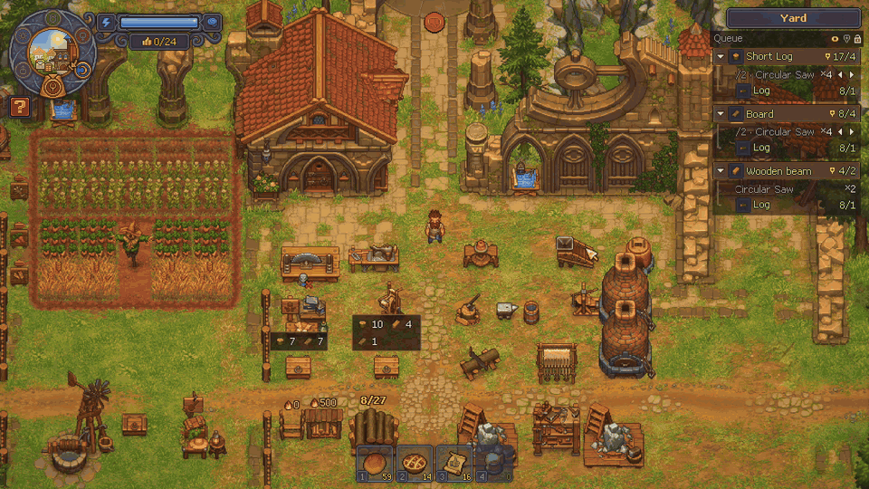
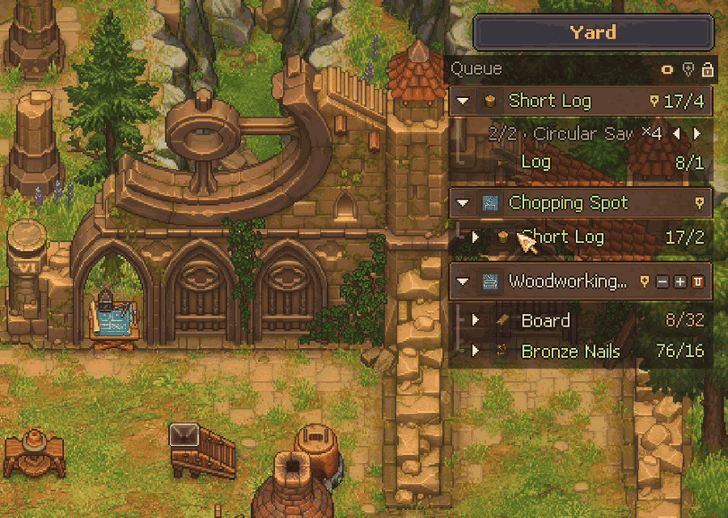

# Crafting Queue for Graveyard Keeper 2

**English** | [Español](README.es.md)

A mod that keeps a **crafting queue always on screen**. It shows what you want to make, what it takes, what you already have, and which chest it's in.

> ⚠️ **Beta.** The mod is still being tested, so expect some bugs. Please [report them](#reporting-bugs). It really helps.
> 🎮 **Gamepad support is even more experimental.** It has barely been tested yet.



---

## Installation (about 2 minutes, no experience needed)

You only do this once. Close the game before you start.

### Step 1: Download the mod

Go to [Releases](../../releases) and download **one** of these files:

- **`CraftingQueue-x.y.z-with-BepInEx.zip`**: get this one if you're not sure. It has everything you need.
- `CraftingQueue-x.y.z.zip`: only the mod. Use it if you already play with other BepInEx mods.

### Step 2: Copy the address of your game folder

1. Open **Steam** and go to your **Library**.
2. Right-click **Graveyard Keeper 2** → **Manage** → **Browse local files**. A folder opens; this is your *game folder*.
3. Click the **address bar** at the top of that folder (where the path is shown), then press **Ctrl + C** to copy it.

> 💡 It doesn't matter which drive or folder your game is on. Steam always opens the right one.

### Step 3: Extract the mod into that folder

1. Find the file you downloaded (it's usually in **Downloads**).
2. Right-click it → **Extract All…**
3. Delete the path that appears in the box, then press **Ctrl + V** to paste your game folder's address.
4. Click **Extract**. If Windows asks about replacing files, choose **Replace**.

### Step 4: Check that it worked

Open the game folder again. You should now see a **`BepInEx`** folder next to `GraveyardKeeper2.exe`:

```
Graveyard Keeper 2
├─ BepInEx               ← new
├─ winhttp.dll           ← new
├─ doorstop_config.ini   ← new
└─ GraveyardKeeper2.exe
```

Start the game and load your save. A **Queue** panel appears at the top right. 🎉
To add something, hold **Ctrl** and right-click any item.

<details>
<summary><b>Something went wrong?</b></summary>

| What you see | What to do |
|---|---|
| There's a folder called `CraftingQueue-...` inside the game folder, and the `BepInEx` folder is inside it | Move everything from inside that folder into the game folder, then delete the empty folder. |
| The game opens but there's no panel | Press **F3** (it may be hidden). If it's still missing, open **Troubleshooting** near the end of this page. |
| Windows or your antivirus warns about `winhttp.dll` | That file is part of BepInEx, the standard mod loader for Unity games. It's safe; allow it. |

</details>

<details>
<summary><b>Update or uninstall</b></summary>

- **Update:** download the new version and extract it the same way, choosing **Replace**. Your queue is kept.
- **Uninstall:** delete the folder `BepInEx\plugins\CraftingQueue` inside your game folder. Your saves are never touched.
- Your queues are kept outside the game folder, so they survive updates and reinstalls. To erase them too, delete `%USERPROFILE%\AppData\LocalLow\Lazy Bear Games\Graveyard Keeper 2\CraftingQueue` (paste it into the File Explorer address bar).

</details>

---

## Features

### Queue panel, always visible

`have/need` for every material. Expand any material to see how it's made, one recipe at a time, with the station it's made in and how many it makes (`×N`).



- **One option per recipe and per station.** If an item has several recipes, or one recipe can be made in several stations, switch between them with ◂ ▸. Each option shows its own station, yield and ingredients.
- **Only what you can actually use.** Recipes you haven't unlocked stay hidden, and so do stations you can't build yet. As soon as you unlock them (tech tree, quests…), they show up on their own.
- **Real yields.** The `×N` includes your perks and talents, including a zombie's if one works that station. For a station you haven't built yet, it shows the base building plus your perks.
- **A task asks to *have* that many.** What you already own counts, and the recipe below covers only what's missing. Ctrl + right-click on an item or a recipe asks for one more than you have; requests (NPCs, quests, orders, buildings) ask for their exact amount.
- **Shared materials are split in queue order.** If two tasks need logs, the one on top takes what you have first and the next one gets what's left. Reorder tasks with ▲ ▼.
- **Tasks finish on their own** when you craft, pick up or buy what was missing. Buildings and town works go down when you build them.
- **Stock in other zones.** If you're short here but have some elsewhere, the row tells you where, in grey: `· Yard: 7`.
- **Hover a task** to show its ▲ ▼ − + 🗑 buttons and its pin. Drag the title to move the panel; the lock pins it in place.


### Add anything with Ctrl + right-click

Works on almost everything that shows an item or a recipe:

| Where | What gets added |
|---|---|
| Inventory, chests, any item | The item |
| A recipe in a crafting station | "Make this recipe" with its ingredients |
| Build menu / town works | The building with its materials |
| Quest requirements | The item, with the amount the quest asks for |
| Tech tree | The recipe, item or building (blueprint) that a tech unlocks |
| NPC conversations ("0/1" answers) and request pop-ups | The item they ask for, with the amount |
| Vendor orders | The ordered item, with the order's amount |

If the panel is folded because a window is open, it unfolds for a moment so you can see the new task.




### Chest bubbles: see where everything is

Bubbles over the chests and storages in your current zone show which queued materials they hold, and how many.


- **Hover a task or an ingredient** in the panel to see where its materials are right away, even without a pin.
- The **pin next to the lock** (gold when on) marks materials for the whole queue. A **task's pin** marks only that task. New tasks start with their pin on. Pins are saved with your save slot.
- If you already have an item, only the item itself is marked, so you know where to pick it up. If you don't, its ingredients are marked instead.
- Bubbles turn transparent when your mouse is over them or when they cover your character.

### Quick recipe view (Alt)

Hold **Alt** over any item, in your inventory, a chest, or the queue panel itself, to see its full recipe tree without adding it.




### And also

- **Stays out of the way:** with a chest, station or the tech tree open, the panel moves aside on its own side, or folds into a small "Queue" tab that expands when you hover it. Prefer to always see it? Turn on the **eye** icon in the panel's title bar.
- **Pixel-crisp** at 720p, 1080p, 1440p and 4K.
- **Light on performance.** Amounts update in place instead of redrawing the panel, and nothing heavy runs while you play (about 0.1 ms per frame on average).
- **One queue per save slot.** It's saved in its own file and never touches your save.
- **16 languages.** All of the game's official languages; it follows the game's language live.

### What it changes / compatibility

- **No gameplay or balance changes, and your save is never touched.** The mod only reads game data and adds its panel; your queue lives in its own file per save slot.
- **One thing works differently:** while you hold **Ctrl**, right-click adds to the queue instead of doing its normal action.
- **No network access, no data collection, no game files or assets included.** Open source (MIT).
- **Used alongside** BetterAutoCrafting, BetterContainer, BetterItemStacks, BetterPlayerInventory, BigItemStacking and SaveAnywhere during development. If another mod uses the same keys (Ctrl + right-click, Alt, F3, F4), you can change them in the config.

## Controls

| Action | Keyboard / mouse | Gamepad *(experimental)* |
|---|---|---|
| Add to queue | `Ctrl` + right-click | Tap **R3** on the selected slot |
| Show a recipe | Hold `Alt` over an item | Hold **R3** on the selected slot |
| Show / hide panel | `F3` | – |
| Detailed / compact recipes | `F4` | – |
| See where a task's materials are | Hover the task in the panel | Select it in the panel |
| Reorder tasks (priority) | Hover the task → ▲ ▼ | – |
| Use the panel | Mouse | **R3** to enter · D-pad ↑↓ move · → open · ← close · LB/RB switch recipe · X/Y −/+ · A pin · B exit |

## Reporting bugs

Open an [issue](../../issues/new/choose) and include:

1. What you did and what happened (a screenshot helps a lot).
2. Your mod version and game resolution.
3. The file `BepInEx\LogOutput.log` from your game folder (drag it into the issue).

---

<details>
<summary><b>Configuration</b></summary>

Settings live in `BepInEx\config\verto13.gk2.craftingqueue.cfg`. The file is created the first time you play, and every setting is documented inside it: keys, panel side, width, height, icon size, opacity, recipe style…

Your queues are saved in `%USERPROFILE%\AppData\LocalLow\Lazy Bear Games\Graveyard Keeper 2\CraftingQueue\`.

**Translations:** to fix a translation or add a language, copy `BepInEx\plugins\CraftingQueue\lang\_plantilla_en.txt` to `lang\<language code>.txt` and translate the right-hand side.

**Diagnostics:** the `[Diagnóstico] MedirRendimiento` setting (off by default) writes timings to `BepInEx\LogOutput.log` and a list of recipes whose yield depends on perks to the queue folder. It's only for tracking down problems and doesn't change the game.

</details>

<details>
<summary><b>Troubleshooting</b></summary>

- **The panel doesn't appear:**
  1. Check that `BepInEx\LogOutput.log` exists in the game folder. If it doesn't, BepInEx isn't installed; use the *with-BepInEx* zip.
  2. If the log exists, look inside it for `Crafting Queue`.
- **The panel is hidden:** press `F3`.
- **No chest bubbles:** turn on the pin next to the lock (or a task's pin), or hover a task in the panel. Bubbles only show chests in the zone you're in.
- **A recipe doesn't show how to make it:** you probably haven't unlocked it yet. It appears on its own as soon as you do.

</details>

<details>
<summary><b>Building from source</b></summary>

```bash
dotnet build -c Release -p:GameDir="C:\Program Files (x86)\Steam\steamapps\common\Graveyard Keeper 2"
```

`GameDir` must point to a game install with BepInEx 5. The game's assemblies are only referenced to compile; they are never copied into the output or this repository.

</details>

## Notes

- Unofficial mod, not affiliated with Lazy Bear Games.
- Made with the help of AI ([Claude](https://claude.com), by Anthropic): the code was written together with Claude, and every feature was tested in the game before release.
- Contains no game code or assets, and sends no data anywhere.
- The *with-BepInEx* package includes [BepInEx](https://github.com/BepInEx/BepInEx) 5.4.23.5, unmodified (LGPL-2.1).

## License

[MIT](LICENSE)
